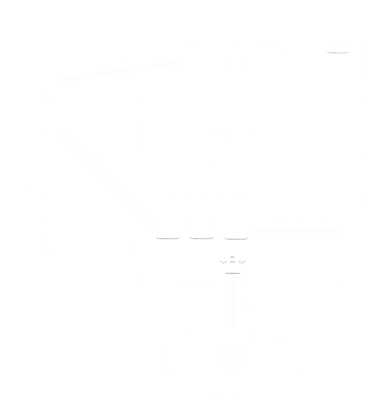
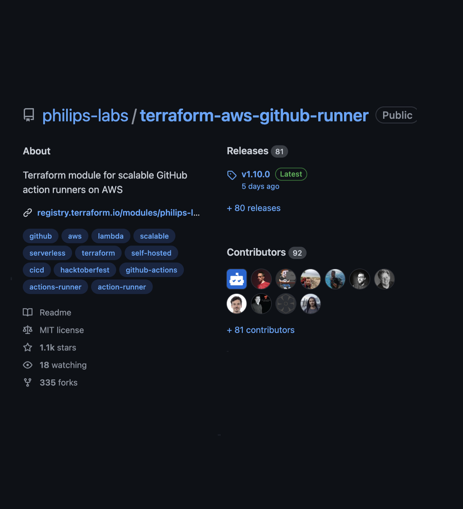
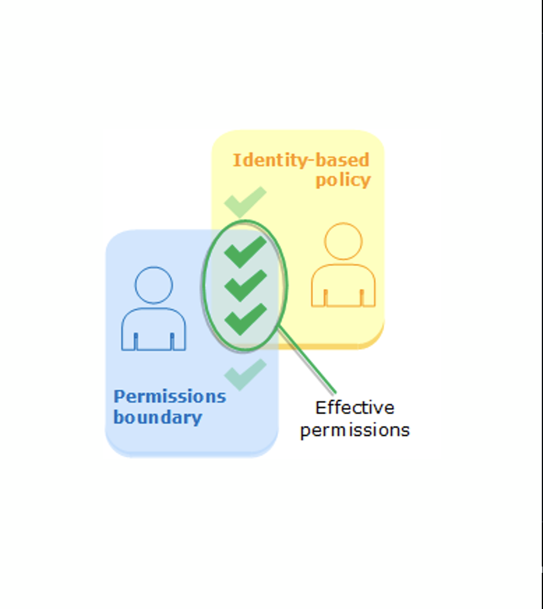
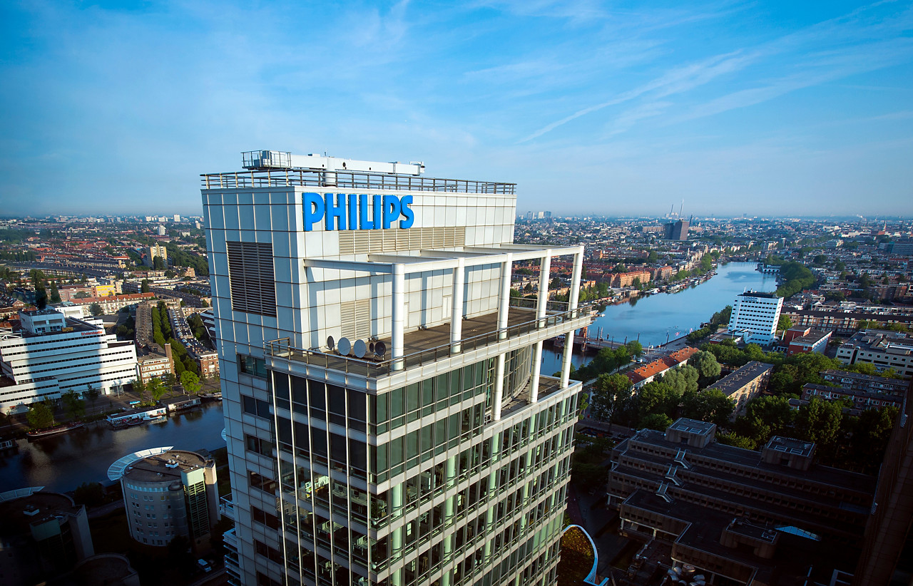

<style scoped>
  h1 {
    padding: 10px;
  }
</style>

# <!--fit--> **Accelerating** InnerSource at enterprise scale 
# <!--fit--> with GitHub action runners in **AWS cloud** at Philips

<br>

<br>

<br>

<br>

<br>

<br>

## Niek Palm

<!--  -->


---


<!--
_backgroundColor: #002C77
_color: white
-->

# How do you picture Philips?


<!--
What are we doing here?
Philips is a worldwide recognisable brand almost everyone in the world has heard of Philips.
But you don't think of software.
How do you picture philips?
-->

---
<!--
_backgroundColor: #00629F
_color: white
-->


# Probably this?

---

<!--
_backgroundColor: white
_color: #0072DA
-->


# Maybe this?

---

# <!-- fit --> Not this


<!--
_backgroundColor: #0072DA
_color: white
-->


---

<!--
_backgroundColor: #0072DA
_color: white
-->

## Philips is a **health technology** company improving people's health and well-being through meaningful innovation

## Our purpose is to improve people’s health and well-being. We aim to improve 2.5 billion lives per year by 2030


---

<!--
_backgroundColor: #0072DA
_color: white
-->

# Software in Philips

- Global Organisation

- Cloud | Web | Mobile | Embedded

- 6500+ Software Professionals

- 100s Millions lines of code

- Regulated Medical Software


<!-- 
We build a lot of software in philips
We have a lot of different business units that historically have little alignment
 -->

---

<!--
_backgroundColor: #D10077
_color: #EABEDB
-->

# InnerSource Journey

InnerSource is a development methodology where engineers build proprietary software using best practices from large-scale open source projects.


<!-- 

InnerSource is key to our software strategy

In Philips we combine world class tools to enable teams to focus on meaningful innovation to improve people lives.
 -->

---

<!--
_backgroundColor: #269A91
_color: #244C5D
-->

## <!--fit--> How we started?

🏛️ March 2020

👨🏽‍💻 InnerSource as default

✨ GitHub for source code

☁️ Preferred cloud AWS

🔌 Empower everyone with CI/CD


---

<!--
_backgroundColor: #0072DA
_color: #93C2F8
-->

# 101 - GitHub Actions

- Actions == GitHub CI/CD ++
- Actions == CI/CD Lego bricks
- Jobs are triggered by an event
- Jobs require a runner to run

```yaml
on: [push]
jobs:
  check-bats-version:
    runs-on: [ubuntu-latest]
    container: node:16
    steps:
      - uses: actions/checkout@v3
      - run: npx bats -v
```


---

<!--
_backgroundColor: #269A91
_color: #244C5D
-->

# <!-- fit --> 🔌 Connectivity


---

<!--
_backgroundColor: #269A91
_color: #244C5D
-->

# <!-- fit --> ⚙️ Hardware


---

<!--
_backgroundColor:  #BE5500
_color: #FDD37A
-->

# <!-- fit --> 💰 Costs


---

<!--
_backgroundColor: #008540
_color: #144835
-->

# <!-- fit --> 🔐 Control


---

# <!-- fit --> Self-hosted runners gives **control**
# <!-- fit --> but how to get the same **experience**?


<!-- 
With our open source module we auto-scale GitHub self-hosted runners in the cloud, and bring the same experience to our developers as using standard hosted runners.

-->


<!-- 
Ideally we would use the public runners - but we cant because 
-->


---

<!--
_backgroundColor: #008540
_color: #144835
-->

# <!-- fit --> Manual?


---

<!--
_backgroundColor: #002C77
_color: #93C2F8
-->

# <!-- fit --> 💡 Idea

- Cloud
- Run on standard minimal VMs
- Tailor OS / Arch
- Scale up / down / zero
- Connection enterprise network
- Only pay for what's used




---

<!--
_backgroundColor: #D10077
_color: #6D1E4A
-->

<style scoped>
h2 {
  text-align: center;
  font-size: 75px;
  color:  #FABCDB;
}
</style>

# <!-- fit --> Event based

## Scale based on workflow jobs


---

<!--
_backgroundColor: #008540
_color: #144835
-->

<style scoped>
h2 {
  text-align: center;
  font-size: 62px;
  color: #A0DABB;
}
</style>

# <!-- fit --> Serverless

## low cost / low maintenance control plane


---

<!--
_backgroundColor: #269A91
_color: #244C5D
-->

<style scoped>
h2 {
  text-align: center;
  font-size: 75px;
  color: #7EDDDE;
}
</style>

# <!-- fit --> Treat as Cattle

## Secure and no fire fighting


---

<!--
_backgroundColor: #DE7C00
_color: #9B3426
-->

<style scoped>
h2 {
  text-align: center;
  font-size: 75px;
  color: #FDD37A;
}
</style>

# <!-- fit --> Networking

## Bring your own connection

<!-- 
Connectivity is abstract of the end solution. You bring the solution to your network and take advantage of it 
-->

---

<!--
_backgroundColor: #269A91
_color: #244C5D
-->

<style scoped>
section {
  font-size: 28px;
}
</style>

# Cloud Solution

**Serverless** contol plane receiving events from GitHub and scale new self-hosted runners using **AWS EC2 Spont Instances**

**Terraform module** with out of the box working configuration which can be tailored to for specific use-cases. AWS Lambda's build in **TypeScript**.


<!--  
* GitHub App for events
* AWS API gateway to get events
* AWS Lambda for event handling
* AWS SQS for decoupling
* AWS Lambda to scale up
* GitHub App for API access
* AWS EC2 (Spot) to run jobs
* AWS Direct connect for networking
* AWS Lambda for scaling down -->


---

<!--
_backgroundColor: #269A91
_color: #244C5D
-->

<style scoped>
section {
  font-size: 28px;
}
</style>

# Scale up


* GitHub sends event App webhook
* AWS API gateway to get events
* AWS Lambda verifies event
* AWS SQS for decoupling / delay
* AWS Lambda to create EC2 runner
* GitHub App for API access


---


<!--
_backgroundColor: #269A91
_color: #244C5D
-->

<style scoped>
section {
  font-size: 28px;
}
</style>

# The runner

* Support Spot and On-Demand
* Create instance by CreateFleet API with type `Instant`.
* Limit permission to the istance
* Optional ephemeral
* Optional bring your own AMI and custom cloud-init
* Cached GitHub agent to improve boot time.


---

<!--
_backgroundColor: #269A91
_color: #244C5D
-->

<style scoped>
section {
  font-size: 28px;
}
</style>

# Scale Down

* No event
* Self terminating ephemeral runners
* Scale down job, to remove idle instances from the cattle


---

# <!-- fit --> 📢 DEMO

* Create cloud resources
* Connect cloud with GitHub
* Run 40 jobs


---

<!--
_backgroundColor: #269A91
_color: #244C5D
-->

# Open Source

⭐ 1K+ stars

✨ 90+ contributors

❤️ 400+ Pull requests

🏆 Recommended by GitHub



<!-- 

topics we could cover

- PR checks automated
- Automated release
- Slack
- Build a community
 -->

---

<!--
_backgroundColor: #008540
_color: #144835
-->

# Contribution

- Support windows
- Support ARM
- Support GHES
- Better docs
- Security improvements
- Upgrades


---

<!--
_backgroundColor: #DE7C00
_color: #9B3426
-->

# <!-- fit --> Running at Scale

# <!-- fit --> in Philips


---

<!--
_backgroundColor: #8345BA
_color: #3D0F58
-->

# Deployment

* Deploy runners with the runners
* Terragrunt to keep our Terraform dry
* Connect to Philips with AWS Direct Connect
* Work together with security to change firewall rules
* Limit AWS access by permission boundaries


---

<!--
_backgroundColor: #8345BA
_color: #3D0F58
-->

# Deployment

Now can we avoid avoid using keys in CI?

* Define OIDC provider for GitHub in AWS
* Create role with turst based on claim
8 Define policies for role


---

<!--
_backgroundColor: #8345BA
_color: #3D0F58
-->

# Deployment


Trust

```json
{
    "Sid": "",
    "Effect": "Allow",
    "Principal": {
        "Federated": "arn:aws:iam::<id>:oidc-provider/token.actions.githubusercontent.com"
    },
    "Action": "sts:AssumeRoleWithWebIdentity",
    "Condition": {
        "StringLike": {
            "token.actions.githubusercontent.com:sub": "<claim>"
        }
    }
}
```

Action

```yaml
jobs:
  permissions:
    id-token: write

  deploy:
    steps:
      - uses: aws-actions/configure-aws-credentials@v1
        with:
          role-to-assume: ${{ inputs.aws_role_to_assume }}
          aws-region: ${{ inputs.aws_region }}
```


---
<!--
_backgroundColor: #8345BA
_color: #3D0F58
-->

# Limit access by Permissions Boundaries

Define identity permission
```json
{
  "Effect": "Allow",
  "Action": ["iam:*"],
  "Resource": "*"
}
```

Limit by boundary
```json
{
  "Effect": "Allow",
  "Action": [
    "iam:DeleteRole"
  ],
  "Resource": "arn:...:role/github-runners/*"
}
```



---

<!--
_color: white
-->

# <!-- fit --> Scaling in and out 


---
<!--
_color: white
-->

<style scoped>
  h1 {
    background-color: rgba(0, 50, 93, 0.7);
    padding: 10px;
  }
</style>

# <!-- fit --> 15K instances on a average day


<!--
runners last 3 months per day 
-->

---

# Lessons learned


---

<!--
_backgroundColor:  #002C77
_color: #93C2F8
-->

# Speed

* Caching GitHub runner binary
* Pre-build AMI


---

<!--
_backgroundColor:  #002C77
_color: #93C2F8
-->

# CI DOS


---

# Rate Limits


---

# <!-- fit --> Network


---

# Costs


---
# Questions

<style scoped>
section {
  font-size: 70px;
}
</style>


---
<!--
_backgroundColor: black
-->

```hcl
# Resources

resource "website" "github_runners" {
  url = "github.com/philips-labs/terraform-aws-github-runner"
}

resource "website" "github_oidc" {
  url = "github.com/philips-labs/terraform-aws-github-oidc"
}

resource "website" "slides" {
  url = "github.com/philips-labs/2022-10-03_scaling-github-runners"
}

resource "contact" "niek" {
  github   = "@npalm"
  linkedin = "in/niekpalm/"
  twitter  = "@niekos77"
}


```


---

<br>
<br>
<br>

# <!-- fit --> We're writing **code** 
# <!-- fit --> to **change** health technology

<style scoped>
section {
  font-size: 50px;
}
</style>




